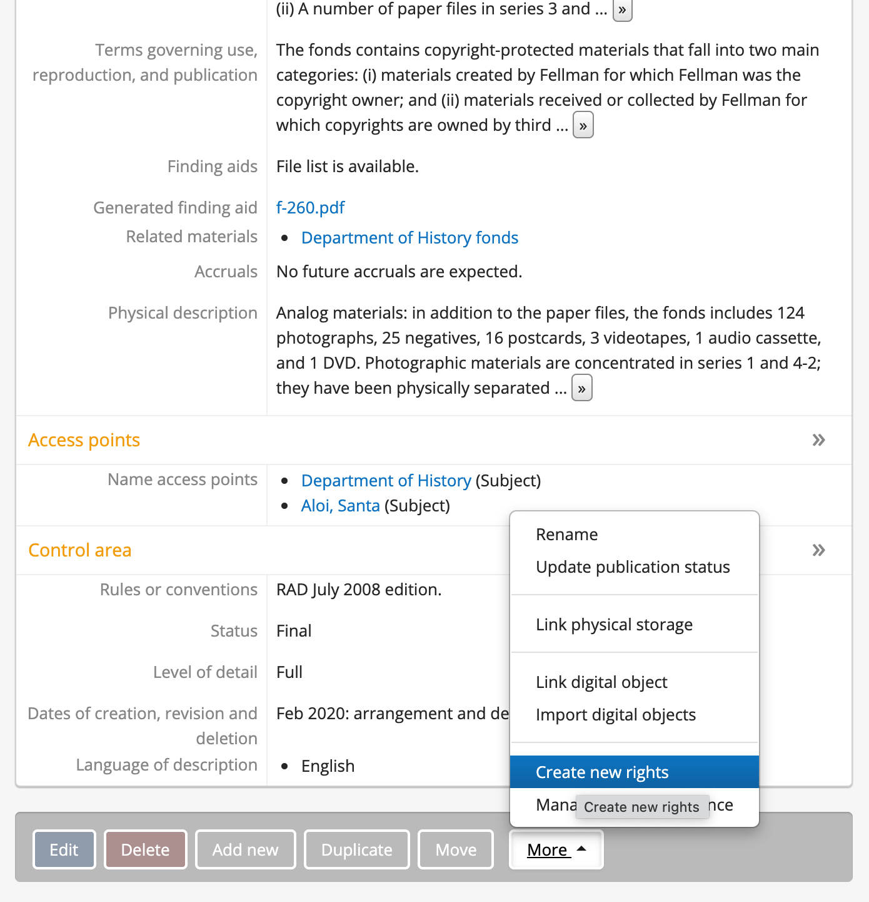
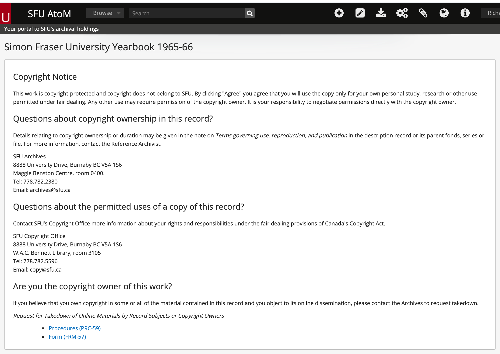

###### [SFU AtoM Guidelines](../README.md) `>` [Archival description](overview.md) `>` [Rights area area](overview.md#rights-area)

# Rights area
| Fonds 	| Series 	| Files 	| Items 	|
|:-----:	|:------:	|:-----:	|:-----:	|
|   OP    |   OP    |   IA  	|   IA  	|

The Archives uses this area at the `file` and `item` levels in **one use case only**: managing copyright in third-party protected works.
- The description has an associated `digital object` uploaded to AtoM.
- Copyright belongs to third parties (not SFU); in many cases materials will be orphan works (copyright owner unknown or unlocatable).
- The Archives deems the materials `low risk` and will disseminate them online without first seeking the owner's permission.

Where this scenario applies to `files` or `items`, one `Rights statement` is **required**. AtoM `Rights statements` are actionable: certain settings entered in the `Rights area` will cause a pop-up `Copyright notice` to appear which users must click through (agree to certain conditions) in order to access the full digital object. This section describes how to enter those settings.

It is **optional** to create `Rights statements` at parent `fonds` or `series` levels in order to use AtoM inheritance rules to apply the same statement to all child `files` or `items`.
- This saves repetitive manual data entry.
- Do not use `Rights statements` at aggregate levels for any other purposes.

The `Rights area` can also be used for other purposes but currently this is the only use by SFU Archives. For previous practice (ca. 2016-2021), see the [Background and legacy data](#background-and-legacy-data) section below.

# Create a Rights statement

Click the `More` at the bottom of the description and from the pop-up menu select `Create new rights`. Enter the following settings.
- `Basis` = "Copy"
- `Copyright status` = "Under copyright"
- Leave the rest of the fields in the `Basis` section blank.
- You will need to delete the default data supplied in the `Start` field.

In the `Granted right 1` section:
- `Act` = "Display"
- `Restriction` = "Conditional"
- Leave the remaining fields blank.

# Copyright Notice screen

Once these settings are applied, users clicking the description's `digital object` are routed first to a `Copyright Notice` screen. This tells them that:
- The works are protected by copyright and SFU is not the copyright owner.
- SFU Archives makes the works available under the `fair dealing` provisions of Canada's [Copyright Act](https://laws-lois.justice.gc.ca/eng/acts/C-42/Index.html).
- Users may download copies for their own private study, research purposes, or other purpose permitted under fair dealing.
- Any other use of the materials may require the permission of the copyright owner, and it is the user's responsibility to obtain such permissions.

The screen also provides links to the Archives take-down procedures and take-down request form (both in pdf form).

## Background and legacy data
The AtoM `Rights area` provides a set of fields drawn from the [PREMIS Data Dictionary for Preservation Metadata](https://www.loc.gov/standards/premis/). SFU Archives was one of the original sponsors of development of this feature in AtoM, and we began using it ca. 2016.

Our original plan was to use these fields for three distinct requirements:
1. Manage dissemination of low-risk copyright-protected materials through the `Copyright Notice` (as described above).
2. Restrict access to born-digital materials uploaded to AtoM from Archivematica.
3. Document informal access and copyright reviews of individual files and items.

Changes to our Archivematica workflow meant we could abandon requirement 2 (restrict access).
- If materials have any access restrictions (or are "pending review"), we do not send them from Archivematica to AtoM or we do a metadata-only DIP upload.
- This means that all `digital objects` in SFU AtoM have `access status` = "Open".

Experience with requirement 3 (document access and copyright reviews) has lead to discontinue this practice.
- Our usage was basically a "hack" of PREMIS fields not intended for this purpose.
- Data entry was laborious, time-consuming, and prone to inconsistency.
- The data could not be searched in AtoM.

Beginning in 2021, the Archives has simplified documentation of access and copyright reviews by shifting this to a note in the [Rights](rights.md) field.
- Legacy data remains in the PREMIS `Rights area`.
- The Archives will determine at a later date what to do with this data (convert, delete, or leave as is).

---
###### [<< Previous: Control area](control-area.md) `|` [Next: Physical storage >>](physical-storage.md)
---
###### Last updated: Jan 20, 2022
###### MA = Mandatory `|` RE = Required for full description `|` IA = Required if applicable `|` OP = Optional `|` NA = Not applicable `|` DN = Do not use
