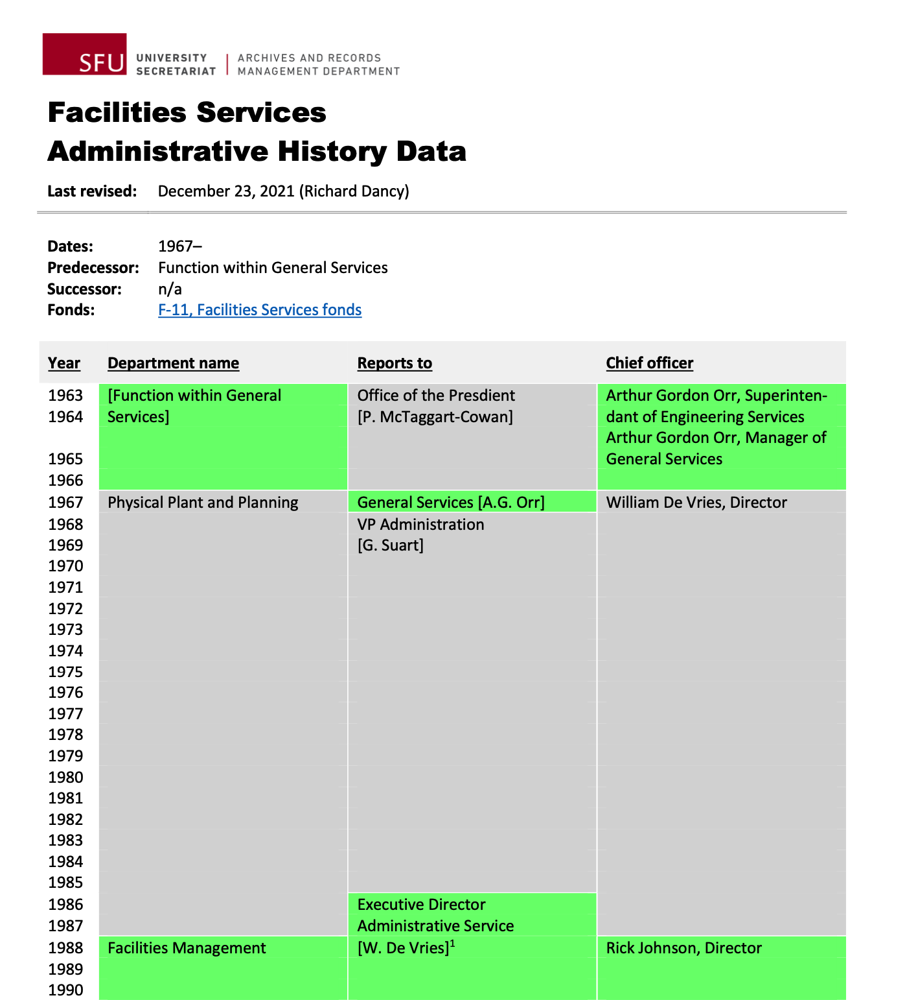

###### [SFU AtoM Guidelines and Processing Resources](../README.md)

# Administrative History Data Template

The [Administrative History Data Template](..downloads/admin-history-data-template.docx) is a Word document. It provides a table for representing administrative history data in visual format. It was designed for description of SFU departments, showing changes over time to a department's name, reporting relationships, and chief officer.
- There are separate columns for `Department name`, `Reporting relationship` (office and officer the department reported to), and `Chief officer` (name and title of the head of the department).
- Create a row for each year.
- Enter a name in the appropriate column in the row for the year it first appears.
- Use alternating colour blocks to show continuity / changes.

The preferred colour scheme is contrasting blocks of green (73FB79) and grey (D9D9D9); use white outside borders to set off the blocks.

Add notes as needed using superscript numbers.

The data forms are intended to be used as standalone appendices in the pdf finding aids of a departmental fonds and should be routinely created as part of an arrangement and description project for university records.

The Archives will also create a compilation of available forms as a single SFU Administrative History Data document available from our website (forthcoming).

**Downloads:**
- [Word template](../downloads/admin-history-data-template.docx)
- [PDF example](../downloads/admin-history-data-example.pdf)

###### Last updated: Jan 27, 2022
