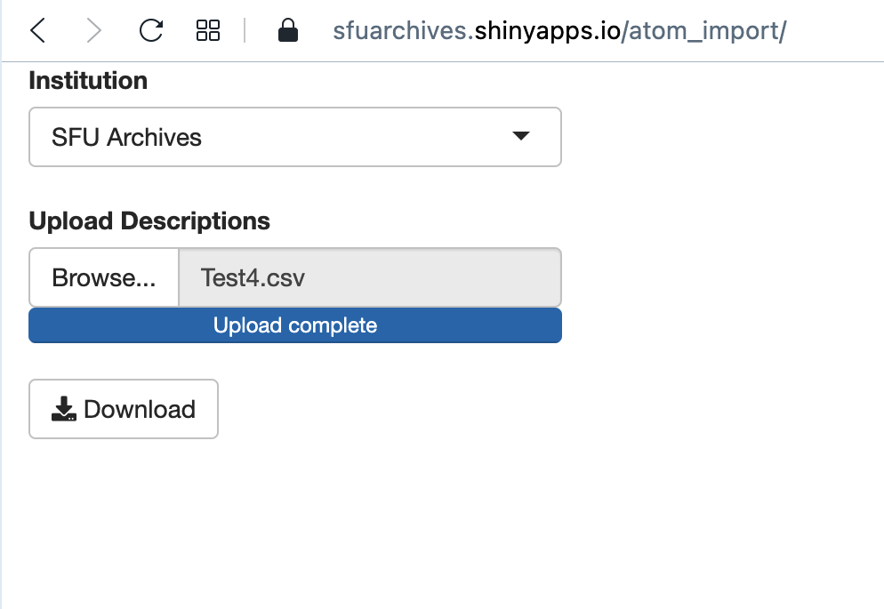
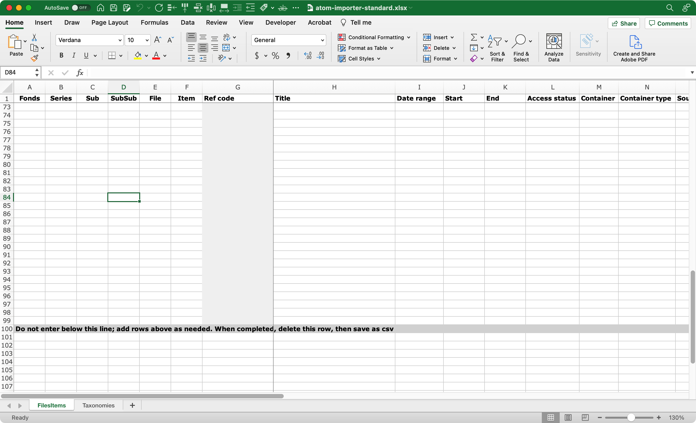
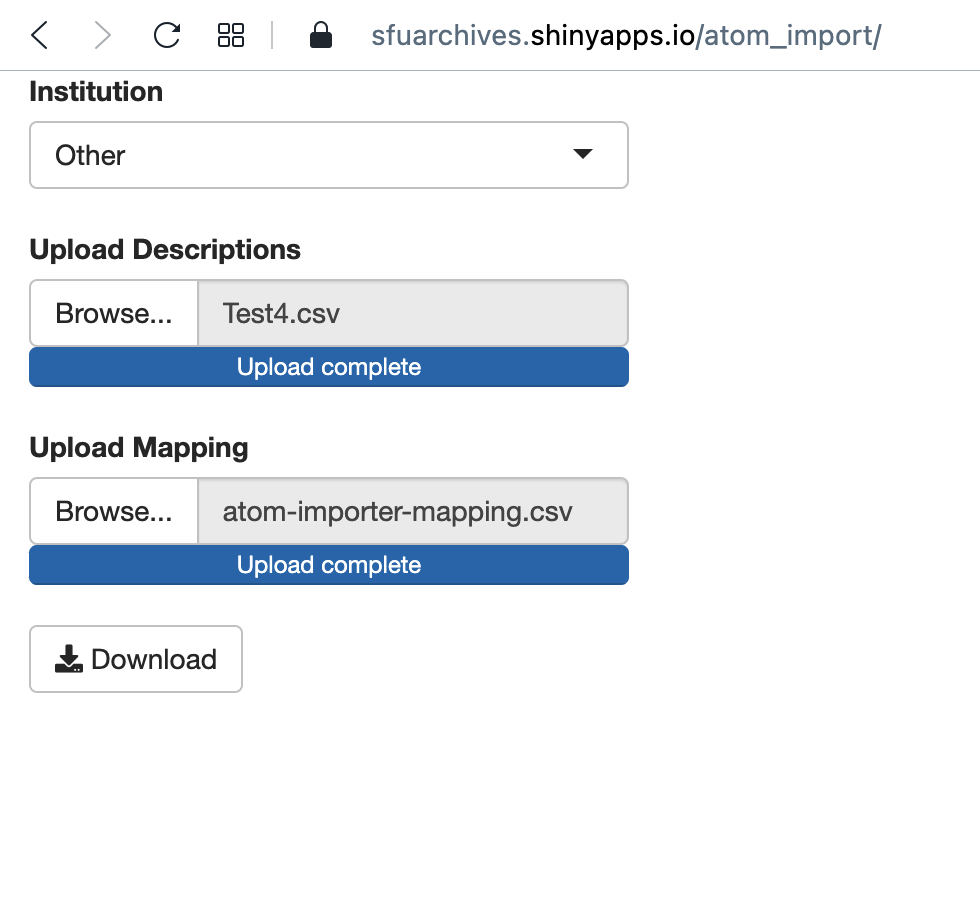
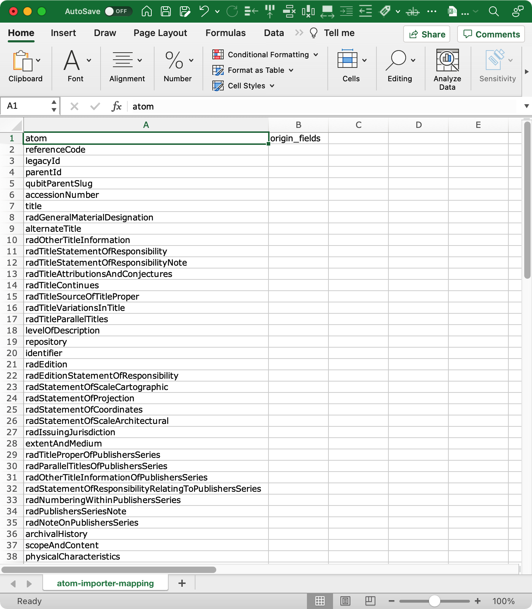

###### [SFU AtoM Guidelines and Processing Resources](../README.md)

# AtoM Importer
The Archives typically requires only minimal description at the `file` and `item` levels – simple lists giving only `Reference code`, `Title`, `Dates`, `Access status`, and `Container number`. It is time-consuming to enter these lists manually in AtoM, record-by-record. But AtoM's [csv import template](https://wiki.accesstomemory.org/wiki/Resources/CSV_templates), with its 80+ columns for every database field, is unwieldy for quick data entry. The Archives' preferred solution is to use our own custom Excel template for listing files / items (with a small number of columns), then transform it via script into a csv format that can be uploaded to AtoM.

The [AtoM Importer app](https://sfuarchives.shinyapps.io/atom_import/) is a web application developed for this purpose. It was written in `R` by Kelsey Poloney and hosted on the Archives' `shinyapps` site. It takes the Archives' custom file list and transforms it into a standard `AtoM csv import file` ready for upload to AtoM. The app allows users to add new templates by providing an interface to map a custom template's column to AtoM fields (see [Add new templates](#add-new-templates) below).

Note that there are separate templates for SFU Archives and SFU Special Collections; the documentation on this page is for the Archives' version.

**Contents:**
- [From Excel to AtoM](#from-excel-to-atom)
- [Notes on usage](#notes-on-usage)
- [Guide to SFU Archives' standard template](#guide-to-the-sfu-archives-standard-template)
- [Custom templates](#custom-templates)

**Downloads:**
- [SFU Archives standard AtoM Importer data entry template (Excel)](../downloads/atom-importer-standard.xlsx)
- [Custom AtoM Importer mapping template (csv)](../downloads/atom-importer-mapping.csv)

**Code and developer documentation:**
- [GitHub developer page (Kelsey Poloney](https://github.com/kpoloney/atom_import_template)

## From Excel to AtoM

1. Download and complete the [SFU Archives standard AtoM Importer data entry template (Excel)](../downloads/atom-importer-standard.xlsx).
2. Save the file as `csv`.
3. Open the online app in any web browser at https://sfuarchives.shinyapps.io/atom_import/.
4. Under `Institution` select "SFU Archives" (or "SFU Special Collections").
5. Under `Upload Description` click the `Browse` button and navigate to / select the csv file you saved in step 2.
6. When upload is complete, a `Download` button appears; click to create and download the data as a `AtoM csv import file`.
7. Open the SFU AtoM production site, log in, and navigate to `Import` > `CSV`.
8. On the `Import CSV` page, use the following settings (these are the defaults, they do not need to be changed):
    - `Type` = "Archival description"
    - `Update behaviours` = "Ignore matches and create new records on import"
    - `Skip matched records` = UNCHECKED
    - `Do not index records` = UNCHECKED
    - Use the `Select file` button to navigate to / select the csv file you created in step 6.

AtoM will import the data and create new description records linked to their existing parent AtoM records.

## Notes on usage
**It is critical that all descriptions listed on your import template ALREADY have parent records in AtoM.**
- Make sure the `fonds` and all `series`, `sub-series`, and `sub-sub-series` already exist in AtoM before importing `files`.
- Import all `files` before you import `items`.
- You cannot for example include both `files` and their child `items` on the same import `csv` file (as you can with the standard `AtoM csv import file`).

The Excel template is mainly intended for listing `files` and `items` but can be used for `series`.
- Alternatively, use a [custom template](#custom-templates) specifically designed for `series`.

When saving the Excel file as csv with a Mac, `character encoding` and `line endings` settings may need to be adjusted.
- Open the csv file in BBEdit and change these to `Unicode (UTF-8)` and `Unix (LF)`.

## Guide to SFU Archives' standard template

[Download the Archives' standard Excel template here.](../downloads/atom-importer-standard.xlxs). The template is an Excel document with 2 tabs. The `FilesItems` tab is for data entry. The `Taxonomies` tab contains the set of controlled terms that generate the drop-down lists on the `FilesItems` tab; terms can be edited here.

**Important:**
- Do not delete or edit the greyed-out `Ref code` column (G) on the `FilesItems` tab: it is a calculation field that generates the unit's full reference code, required for AtoM import

- Do not enter data below the greyed-out line in row 100: add new rows above as needed; delete this line when you have finished data entry and save the document as `csv`.

`Fonds`, `Series`, `Sub[series]`, `SubSub[series]` columns (A-D)
- Enter the reference number.
- Enter `0` if not applicable; **do not leave blank**.

`File`, `Item` columns (E-F)
- Enter the reference number.
- `Item` can be left blank if not applicable.

`Ref code` (G)
- Calculation field that returns the unit's full reference code.
- **Do not edit or delete.**

`Title` (H)
- Enter `file` / `item` title.
- Do not use square bracket for supplied titles; you can add a title note in column O if desired.

`Date range` (I)
- Enter date range as text, e.g. "2009-2012".
- If there is no range, just enter the year, e.g. "2010".
- This is the value that will appear to the public in AtoM; use any qualifiers as needed, e.g. "ca."

`Start` / `End` (J-K)
- Enter a 4-digit number for the start and end year, even if it is the same as `Date range`.
- **Do not leave blank, do not enter any qualifiers or other text.**
- This is the value that AtoM uses behind the scenes for sorting and searching.

`Access status` (L)
- Select a value from the drop-down list.
- List terms can be edited on the `Taxonomies` tab.

`Container` (M)
- Enter the container number, e.g. "1", "15".
- **Do not include the fonds prefix (e.g. "260-1"); the hyphen can cause Excel to interpret and reformat the date as a date.**
- You can also enter `Object ID` or `Box ID` numbers here if appropriate (e.g. "OBJ-40888", "BOX-76445").
- For `files` that are stored directly to shelf (no `container`), enter "Shelf".

`Container type` (N)
- Select a value from the drop-down list (terms can be edited on the `Taxonomies` tab).

`Source of title` (O)
- Enter a RAD `Title note` if desired.
- Can be left blank.

`Note` (P)
- Any notes for your own reference, e.g. to help when writing `series` descriptions.
- **This data will not be imported into AtoM.**

When you have completed data entry, delete the last greyed-out line and save the file as `csv`.

## Custom templates

The standard template covers the typical `file` or `item` list SFU Archives requires. But for special cases that use other fields, you can create custom templates.

Possible use cases:
- In-house digitization projects.
- Metadata supplied by vendors in outsourced digitization work.
- Descriptive data stored in legacy systems.
- Retroactive addition of data or revision to existing AtoM descriptions.

**How to use:**

 

1. Create and complete your custom template.
2. Save as `csv`.
3. Complete the [AtoM Importer Mapping Template](../downloads/atom-importer-mapping.csv) to map the columns of the custom template to the AtoM fields.
    - The AtoM fields are all listed in column A.
    - Enter the name of your template's column against the appropriate AtoM field.
    - Use `[=xxxxx]` to set default data (will be entered in all rows).
4. Open the [online AtoM Importer app](https://sfuarchives.shinyapps.io/atom_import/).
5. Under `Institution` select "Other".
6. Under `Upload Description` select the csv file you saved in step 2.
7. Under `Upload Mapping` select the csv mapping document you created in step 3.
8. When upload is complete, a `Download` button appears; click to create and download the data as a `AtoM csv import file`.

---
###### Last updated: Feb 1, 2022
