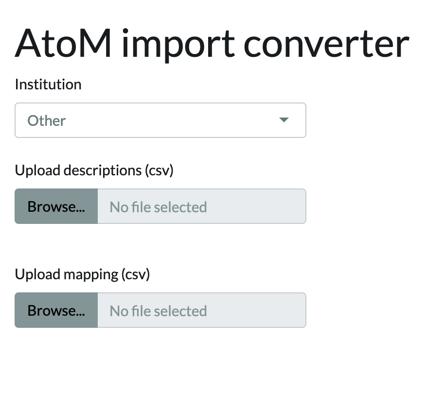
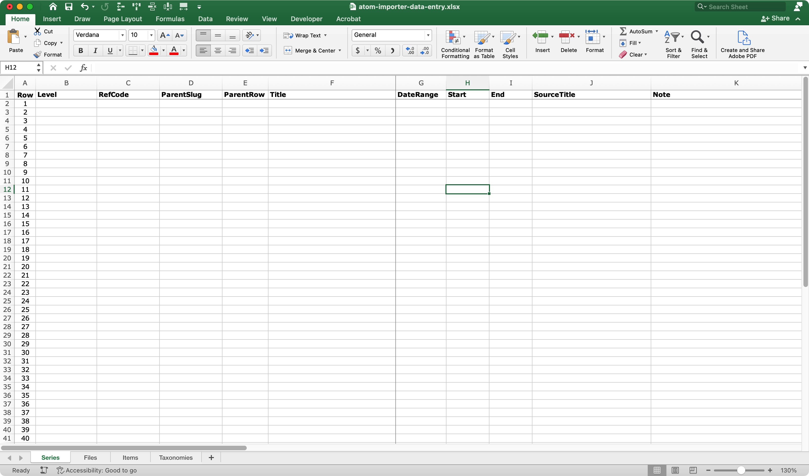
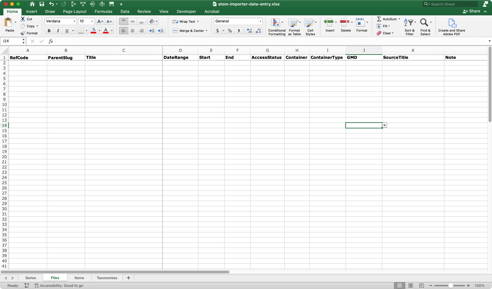
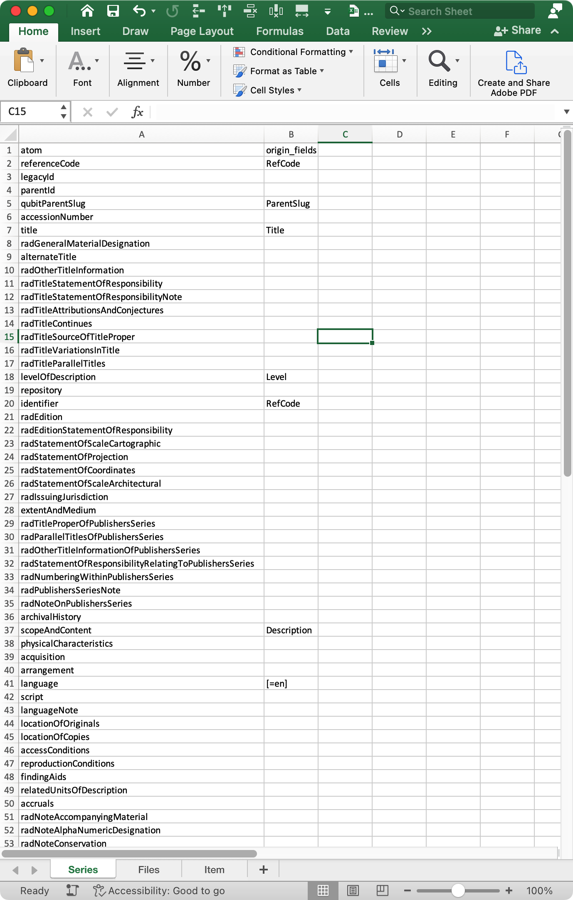

###### [SFU AtoM Guidelines and Processing Resources](../README.md)

# AtoM Importer
###### Last updated: Apr 12, 2023
The Archives typically requires only minimal description at the **file** and **item** levels – simple lists giving only `Reference code`, `Title`, `Dates`, `Access status`, and `Container number`. It is time-consuming to enter these lists manually in AtoM, record-by-record. As an alternative, you can use either the standard AtoM csv import template or SFU Archives' own custom import templates.

**Contents:**
- [Standard AtoM import template](#standard-atom-import-template)
- [SFU Archives custom import templates](#sfu-archives-custom-mport-template)
  - [Complete the data-entry template](#complete-the-data-entry-template)
  - [Save the field-mapping document](#save-the-field-mapping-document)
  - [Adjust formatting](#adjust-formatting)
  - [Use the online AtoM Import Converter app](#use-the-online-atom-import-converter-app)
- [Customize the Archives' templates](#customize-the-archives-templates)
- [Data entry guidance - series](#data-entry-guidance---series)
- [Data entry guidance - files / items](#data-entry-guidance---files--items)
- [Field mapping guidance](#field-mapping-guidance)
- [Links and downloads](#links-and-downloads)

## Standard AtoM import template
The AtoM import template is a csv file with columns for each AtoM field (80+ columns). Once completed, it can be uploaded directly to AtoM.
1. Download [the AtoM csv import template](https://wiki.accesstomemory.org/wiki/Resources/CSV_templates) from the AtoM documentation site.
2. Delete any columns not required.
3. Enter data, save the csv file.
4. Open the SFU AtoM production site, log in, and navigate to `Import` > `CSV`.
5. On the `Import CSV` page, use the following settings (these are the defaults, they do not need to be changed):
    - `Type` = "Archival description"
    - `Update behaviours` = "Ignore matches and create new records on import"
    - `Skip matched records` = UNCHECKED
    - `Do not index records` = UNCHECKED
    - Use the `Select file` button to navigate to / select the csv file you created in step 6.

AtoM will import the data and create new description records linked to their existing parent AtoM records.

See [AtoM documentation](https://www.accesstomemory.org/en/docs/2.7/user-manual/import-export/csv-import/#csv-import) for more information on this process.

## SFU Archives custom import templates
The Archives has its own custom import templates. These differ from the standard AtoM template in that they are in Excel rather than csv format. They allow you to:
- Use calculation fields in the template (e.g. for reference codes).
- Use controlled vocabularies to ensure consistent data entry (drop-down menus).
- Easily set default values for specific fields.

The main drawback is that the import process is more complicated with the SFU templates. With these you must:
- Create both a `data-entry` file and an AtoM `field-mapping` file and save both as csv.
- Use the online [AtoM Import Converter app](https://sfuarchives.shinyapps.io/atom_import/) to transform the Archives' template into the standard AtoM csv template ready for upload to AtoM.

### Complete the data-entry template
Download the Excel [Data entry template](../downloads/atom-importer-data-entry.xlsx).
- It includes separate tabs for listing series, files, and items, as well as a tab for taxonomies (controlled terms used on the other data in the form of drop-down menus).

**It is critical that all descriptions listed on your import template ALREADY have parent records in AtoM.**
- Make sure the **fonds** and all **series**, **sub-series**, and **sub-sub-series** already exist in AtoM before importing **files**.
- Import all **files** before you import **items**.
- Only with the **series** tab can you include both parent and child series on the same spreadsheet.

See below ([Data entry guidance](#data-entry-guidance)) for more detail on completing the template.

When data entry is complete, save the tab as a csv file.

### Save the field-mapping document
Download the Excel [Field mapping document](../downloads/atom-importer-field-mapping.xlsx). This maps the columns in your `data-entry` csv file to the corresponding AtoM field.
- It also includes separate tabs for series, files, and items.

See below ([Field mapping guidance](#field-mapping-guidance)) for more about editing AtoM field mapppings.

Save the appropriate tab as a csv file, e.g. use `Files` for a file list, `Items` for an item list, etc.

### Adjust formatting
When saving the both Excel files as csv with a Mac, `character encoding` and `line endings` settings will need to be adjusted.
- Open the csv file in BBEdit and change these to "Unicode (UTF-8)" and "Unix (LF)" respectively.

### Use the online AtoM Import Converter app

The [AtoM Import Converter app](https://sfuarchives.shinyapps.io/atom_import/) is a web application, written in `R` by Kelsey Poloney and hosted on the Archives' `shinyapps` site. It takes the two csv files (data-entry and field-mapping) to create a standard AtoM csv import file ready for upload to AtoM.

Under `Institution` select "Other".

Under `Upload descriptions (csv)`, click the `Browse` button and navigate to / select your `data-entry.csv` file.

Under `Upload mapping (csv)`, click the `Browse` button and navigate to / select you `field-mapping.csv` file.

The app will create a new csv file called `atom_import.csv` and save it to your `Downloads` folder.
- This file is ready for upload to AtoM following the same steps above described under [Standard AtoM import template](#standard-atom-import-template).

Note that in earlier versions of the app, you could specify the institution (either SFU Archives or SFU Special Collections) and upload an institution-specific template, omitting the need to upload the `field-mapping` file.
- This is no longer supported; you must ALWAYS select "Other" as the `Institution` and upload a `field-mapping` file.

## Customize the Archives' templates
You can further customize the templates in a number of ways. Customization can be useful for specific projects that have specific descriptive needs (e.g. a digitization project and you want to include information about digitization specs). You can:
- Add new columns for entering data in additional AtoM fields.
- Edit existing taxonomies or add new ones on the `Taxonomies` tab.
- Add / edit default values on the `field-mapping` file.

If you add new columns to the `data entry` file:
- **Do NOT include blank spaces in the column name:** use e.g. `ScopeContent` instead of `Scope and content`.
- Update the `field-mapping` file by indicating which AtoM field the new columns map to (see below, [Field mapping guidance](#field-mapping-guidance)).

If you do not need a column on a specific template, you can simply delete it; you do not need to make any changes to the `field-mapping` file.

## Data entry guidance - series

Use the `Series tab` on the `data-entry` template to create a set of new series records in AtoM.
- It must be used with the `Series tab` on the `field-mapping` file.

Do not enter below row 52; add new rows above this line as needed (drop-down menus will not work below this line).

`Row` (A)
- Unique row number.
- Default set to "1, 2, 3 ..."

`Level` (B)
- Select the level of description.
- Drop-down list values generated on `Taxonomies tab`.

`RefCode` (C)
- Enter the series reference code.
- Include the "F-" prefix (using uppercase "F").

`ParentSlug` (D)
- Enter the AtoM "slug" of the immediate parent record (fonds or series) **if the record already exists in AtoM**.
- The slug will be the parent's reference code.
- **The "f-" prefix MUST be give as lower-case** ("f-260-1" rather than "F-260-1").
- Leave blank if the parent record does not yet exist in AtoM.

`ParentRow` (E)
- Enter the `Row` number (column A) of the immediate parent record (fonds or series) **if the record DOES NOT already exist in AtoM**.
- When this column is entered, AtoM will establish the parent-child relation during import.
- Leave blank if the parent record already exists in AtoM.

`ParentSlug` vs `ParentRow`
- Use `ParentSlug` when the parent record already exists in AtoM, otherwise use `ParentRow`.

`Title` (F)
- Enter series title.

`DateRange` (G)
- Enter date range as text, e.g. "2009-2012".
- If there is no range, just enter the year, e.g. "2010".
- This is the value that will appear to the public in AtoM; use any qualifiers as needed, e.g. "ca."

`Start` / `End` (H / I)
- Enter a 4-digit number for the start and end year, even if it is the same as `Date range`.
- **Do not leave blank, do not enter any qualifiers or other text.**
- This is the value that AtoM uses behind the scenes for sorting and searching.

`SourceTitle` (J)
- Enter a RAD `Title note` if desired.
- Can be left blank.

`Note` (K)
- Any notes for your own reference, e.g. to help when writing `series` descriptions.
- **This data will not be imported into AtoM.**

When you have completed data entry, delete the last greyed-out line (row 52) and any empty lines above and save the file as `csv`.

## Data entry guidance - files / items

Use the `Files tab` or `Items tab` on the `data-entry` create a set of new **file** or **item** records in AtoM.
- The columns are all the same.
- Make sure you import the **files** into AtoM before importing **items** (ensures item parents exist in AtoM before import).
- The `Files tab` and `Items tab` are slightly different (default value for `levelOfDescription`); use the appropriate one.

Do not enter below row 101; add new rows above this line as needed (drop-down menus will not work below this line).

`RefCode` (A)
- Enter the file / item reference code.
- Include the "F-" prefix (using uppercase "F").

`ParentSlug` (B)
- Enter the AtoM "slug" of the immediate parent record of the file / item (e.g. sub-sub-series).
- The slug will be the parent's reference code.
- **The "f-" prefix MUST be give as lower-case** ("f-260-1" rather than "F-260-1").

`Title` (C)
- Enter file / item title.
- Do not use square bracket for supplied titles; you can add a title note in column K if desired.

`DateRange` (D)
- Enter date range as text, e.g. "2009-2012".
- If there is no range, just enter the year, e.g. "2010".
- This is the value that will appear to the public in AtoM; use any qualifiers as needed, e.g. "ca."

`Start` / `End` (E / F)
- Enter a 4-digit number for the start and end year, even if it is the same as `Date range`.
- **Do not leave blank, do not enter any qualifiers or other text.**
- This is the value that AtoM uses behind the scenes for sorting and searching.

`Access status` (G)
- Select a value from the drop-down list.
- List terms can be edited on the `Taxonomies` tab.

`Container` (H)
- Enter the container number, include the fonds number prefix (e.g. "260-1").
- Excel may auto-format container numbers as dates (e.g. "4-10" may be transformed into "Apr-10"); you can usually fix this with Excel's "Format cells" setting - set column as Text rather than Number.
- You can also enter `Object ID` or `Box ID` numbers here if appropriate (e.g. "OBJ-40888", "BOX-76445").
- For `files` that are stored directly to shelf (no `container`), enter "Shelf".

`Container type` (I)
- Select a value from the drop-down list (terms can be edited on the `Taxonomies` tab).

`Source of title` (K)
- Enter a RAD `Title note` if desired.
- Can be left blank.

`Note` (L)
- Any notes for your own reference, e.g. to help when writing `series` descriptions.
- **This data will not be imported into AtoM.**

When you have completed data entry, delete the last greyed-out line (row 101) and any empty lines above and save the file as `csv`.

## Field mapping guidance

Each tab on the `field-mapping` Excel document has two columns:
- `atom` = the name of the AtoM field.
- `origin_fields` = the column name on the spread-sheet.

Any column on the `data-entry` file must be mapped to an AtoM field if it is to be imported.
- Columns intended for temporary reference and not for import can be left unmapped.
- An example is the `Note` column on the custom templates; intended only for temporary reference when later writing descriptions.

**Column names CANNOT include blank spaces.**
- Correct: `RefCode`.
- Incorrect: `Ref Code`.

To set default text that will be imported into every record:
- Enter a value in the `origin_fields` column using square brackets (`[]`) + the equals sign (`=`) + the default text (without quotation marks).
- E.g. `[=Final]` in the `descriptionStatus` row will set "Final" as the value in the `Restrictions on access` field on import.

 

## Links and downloads
**AtoM template**
- [Standard AtoM csv import template](https://sfuarchives.shinyapps.io/atom_import/)
- [AtoM documentation](https://www.accesstomemory.org/en/docs/2.7/user-manual/import-export/csv-import/#csv-import)

**SFU Archives custom template (Excel)**
- [Data entry template](../downloads/atom-importer-data-entry.xlsx)
- [Field mapping document](../downloads/atom-importer-field-mapping.xlsx)

**AtoM Import Converter developer documentation**
- [GitHub developer page (Kelsey Poloney](https://github.com/kpoloney/atom_import_template)
