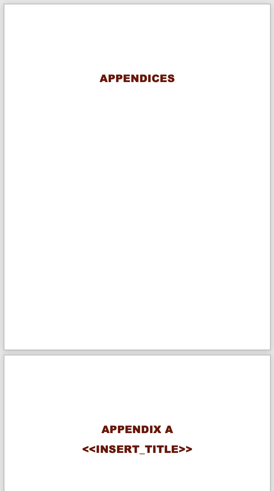

###### [SFU AtoM and Archival Processing Guidelines](../README.md)

# Finding Aid Appendices

You can create / collect documentation outside AtoM that can be added as appendices to the pdf finding aid generated by AtoM.

Examples:
- [Administrative History Data sheets](../downloads/admin-history-data-template.docx) prepared by the archivist.
- Admin history / bio sketch supplied by the records creator.
- Indexes created by the archivist or records creator.
- Reference materials (e.g. articles) relevant to the fonds.
- Older materials that only exist in the appendices of print finding aids.

**Convert to pdf:**
- In the AIS, upload appendix material to the `Fonds` record on the `Documentation` tab.
- Convert all documentation to pdf.
- Download the [Finding aid appendices Word template](../download/finding-aid-appendices-template.docx) (includes the appendices "cover page" and separators).
- Customize the template as needed and save to pdf.
- Combine pdfs into a single file.

**Add appendices to pdf finding aid:**
- In the production AtoM site, go to the fonds records and generate / download the pdf finding aid.
- Use Adobe Acrobat to add combine the appendices with the AtoM-generated finding aid.
- In AtoM, delete the existing pdf finding aid.
- In AtoM, upload the new one.

###### Last updated: Jan 20, 2022
